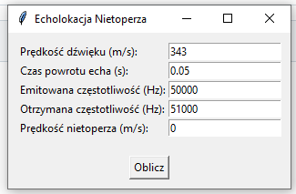
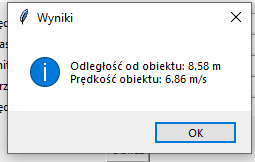

## Collaborants
[Prosty kod Pythonowy z interfejsem](https://github.com/xIshikiri)

# Echolocation
Program zaliczeniowy na Fizykę, oblicza echolokację nietoperza względem obiektów w otoczeniu.

## Description
Prosty kod Pythonowy z interfejsem

## Wpisywanie danych 

## Wynik końcowy

